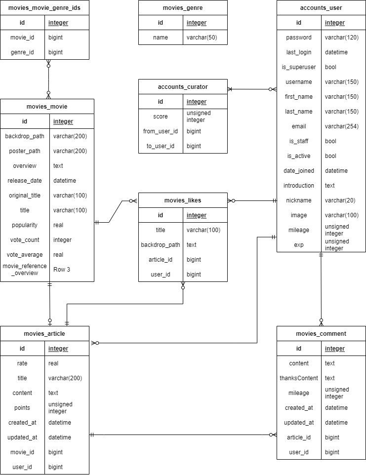

# MOVIE CURATORS

*별도의 PPT가 제공되어있습니다. 자세한 내용과 구현은 그 쪽을 참조해주시면 감사하겠습니다.

## 0. 개요/ 배경

### - 개요

영화 정보 제공, 추천 커뮤니티 사이트 만들기

사이트에서 영화의 정보를 제공하고 토론 공간을 만들어주면 

유저들은 영화에 대한 별점과 함께 평가를 생성/수정/삭제할 수 있고,

다른 유저들은 그 평가를 보고, 댓글을 생성/수정/삭제 해가면서 의견을 공유하고

좋아요와 후원하기를 통하요 해당 유저 내지 평가를 지원할 수 있습니다.


### - 배경과 고민 사항

해당 프로젝트에 들어가면서 가장 먼저 고민한것은

과연 일반적인 커뮤니티에서 남이 단 평가 글에 적극적으로 [좋아요]등을 할 것인지 였습니다.

일반적인 네이버나 다음으로 대표되는 블로그나 카페 커뮤니티에서는 이러한 [좋아요] 문화가 활성화 되어 있지 않습니다.

저희는 유저가 평가를 보고 [좋아요]를 해야할 이유를 마련해야한다고 생각했습니다.

저희는 게임 그 자체가 아닌 게임에 대한 평가를 추천하고 정보를 공유하는 '스팀 큐레이터'에 주목했습니다.


두번째는 프로젝트의 중요한 부분인 영화 추천입니다.

API에서 기본적으로 제공하는 영화 추천은 식상하고, 

좋아요 등을 적극적으로 활용하여 추천하기에는 신생 사이트에 유저 정보가 많지 않아 콜드 스타트(기존 유저 정보 없음), 롱테일(기아 현상)등의 계산 효율 저하현상이 일어나기 쉬웠기에 추천의 대표 알고리즘인 장바구니 알고리즘이나 협력 필터링은 사용하기 애매 했습니다.

저희는 여기서 파이썬의 최대 장점 중 하나인 '머신러닝 알고리즘 라이브러리'가 풍부하다.는 점에 주목했습니다.

저희가 제공하는 DB movie maker을 이용하시면 클릭 두 번으로, 빅데이터 머신러닝 프로세스가 적용된 tmdb2.json 파일이 생성됩니다.


세번째는 프로젝트 수익화 입니다.

프로젝트를 진행하는데 있어서, 저희는 단순한 커뮤니티 사이트 제작이 아니라 거기에 비지니스 모델을 끼워넣음으로서 단순한 HelloWorld를 넘어서 진짜 현실적인 부분을 추구했습니다.  그걸 위하여 실제 스타트업에서 사용하는 린 캔버스로 비지니스 모델을 구축하고 수익화를 위한 모델을 작성하였습니다.그 결과 평가 쓰기 기능을 누가 이용하는 지에 대한 의문에 추가적인 설득력이 생기고, 프로젝트 자체도 현실감이 넘치는 등 여러 장점이 발생하였습니다.


### - 기술스택 / Requirements

- back : Django Restframework, all auth (google)
- front : Vue.js, vuex, vue-router, vuetify, Bootstrap


### - Getting Started

#### datas(00_Movie DB Maker)

폴더 내의 00.movie_api.py와 01.ML_recommend.py를 실행, 최종 생성된 tmdb2.json을 back(pjt-final-drf)의 movies\fixtures폴더 내로 이동

#### back(pjt-final-drf)

```
python -m venv -venv  # 가상 환경 설정
source venv/Scripts/Activate  # 가상 환경 가동
pip install -r requirements.txt  # 필요 패키지 설치

python manage.py makemigrations  # 필요하다면
python manage.py migrate  # migrate 후
python manage.py loaddata tmdb2.json  # 위의 영화 파일 적재
python manage.py runserver  # 서버 가동
```

#### front(pjt-final-vuex)

```
npm i // 패키지 설치
npm run serve // 서버 가동
```

각각 front(pjt-final-vuex)와 back(pjt-final-drf)내의 package.json, requirements.txt에 세세한 모듈이 명시되어 있습니다.


## 1. 영화 추천 알고리즘 - 머신러닝 프로세스(Movie DB Maker)

저희가 영화 추천에 있어서 사용한 빅데이터 머신 프로세싱 방식은 컨텐츠 기반 필터링(content based filtering)입니다.

 컨텐츠 기반 필터링이란 상품 자체를 분석하고 태그화 하여 태그를 추천한다던가 하는 단순한 알고리즘부터, 각각의 음원이 가수, 장르, 작곡가 등의 기준으로 재정리한 특성 프로파일을 만들고 추천하는 알고리즘까지 여러 종류가 존재합니다. 알고리즘 자체는 오래되었지만 워낙 많은 계산량과 기본적인 인프라가 갖춰져 있지 않아서 그렇게 까지 각광 받지는 못했지만, 최근 들어 파이썬에서 데이터 분류를 위한 많은 알고리즘이 적용된 라이브러리들이 나타나면서 생각만 해보았던 이러한 알고리즘들을 실제로 적용할 수 있게 되었고, 이를 이용하여 영화를 추천할 수 있게 되었습니다.


그러나 이러한 빅데이터 머신러닝 프로세스는 계산이 복잡하고 처리가 길기 때문에 그대로 적용하기에는 너무 시간이 오래걸려 서비스에 적합하지 않았습니다. 따라서 저희는 애초에 추천영화를 영화의 정보에 포함시키는 json 파일을 생성하는 프로그램을 제작하기로 하였습니다.

하나의 영화에 대하여 기존 2만개의 영화에 대해 각각 2만번의 행렬연산이 필요했다면, O(N^2)

저희는 필요한 영화에 대해 이미 계산된 영화를 가져오게 함으로써, O(N^2) -> O(1)

획기적으로 시간을 단축하면서 빅데이터 머신러닝 프로세스를 적용할 수 있게 되었습니다.


### 1-1. 00. movie_api.py

저희는 우선 TMDB API를 통해서 

실제로 'title', 'overview'등의 실제 적용할 정보를 위한 한국(ko-kr) 버전의 json 파일(산출물: tmdbkr.json)과 

빅데이터 머신러닝 프로세스에 사용할 영어(en-US)버전의 json 파일(산출물 : tmdb.json)을 생성하는 파일입니다.


TMDB_KEY에 발급받은 API KEY를 입력하고, 

원하는 페이지 (1~1000)을 입력하여 분량을 조절한 후에 

run code를 누르는 것 만으로 쉽게 파일화된 산출 파일이 생성되게 만들었습니다.

[100페이지 기준으로 1920개의 영화가 추출되었으므로 2만개 정도의 DB를 만들 수 있습니다.]


이 과정에서

```
movie.get('release_date') >> 개봉일이 존재하는 영화
movie.get('poster_path') >> 포스터가 존재하는 영화
movie.get('backdrop_path') >> 백드롭이 존재하는 영화
0 < movie.get('vote_average') < 10 >> 평가 추천 시스템상 0점과 10점은 존재할 수 없지만 fill을 위한 더미데이터가 많이 발견 되었습니다.
current_date >= movie.get('release_date') >> 2026년 개봉 영화 등 더미데이터가 추가 되어있 었습니다.
```

같은 추천에 어울리지 않는 불량 데이터를 전처리 할 수 있었습니다.

이러한 데이터의 전처리 또한 저희 방식의 강점이라고 생각합니다.


### 1-2. 01. ML_recommend.py

0.movie_api.py에서 만든 산출물 둘을 이용하여, 

인구통계학적 필터링을 통하여 홈에 추천할 영화 12편을 출력하고

tmdb2.json이라는 각각의 영화에 대한 추천 영화 5편이 기재된 최종파일을 만들어내는 파일입니다.


우선, 메인 페이지에 추천할 영화를 선정하는 방식은 인구 통계학적 필터링(Demographic Filtering)입니다. 인구 통계학적 필터링(Demographic Filtering)이란 더 인기 있고 비평가들의 찬사를 받은 영화가 일반 관객에게 더 좋아질 확률이 더 높다. 라는 기본적인 생각을 적용한 방식입니다. 다만, 30명이 투표한 평점 7.7의 영화보다 100명이 투표한 7.5점의 영화가 더 좋다 같은 가중치 방식과, 6개월 이내의 영화여야한다. 평균이상의 평점이고, 투표치 상위 90%에서만 뽑는다. 같은 제한을 적용하거나 전처리 과정을 체인 필터링하여 사용할 수 있는 아주 우수한 방식입니다.


각각의 영화 추천에는 줄거리 기반 추천(Plot description based Recommender)을 사용하였습니다.

줄거리 설명('overview') 기반으로 모든 영화에 대한 각각의 유사성 점수를 계산하고 유사성 점수를 기반으로 영화를 추천하는 방식입니다.

우선 단어의 수가 아닌 빈도가 필요하고 a나 the 같은 관사를 제거할 필요가 있기 때문에

사이킷런에서 제공하는 TF-IDF(Term Frequency-Inverse Document Frequency) 벡터라이저를 사용하였습니다.

이렇게 벡터라이저 된 함수는 내적을 구하는 것으로 간단하게 코사인 유사도 점수를 구할 수 있었기 때문에,

유사성 점수를 계산하는 데에는 계산이 빠르고 상대적으로 단순한 코사인 유사도 점수를 사용하였습니다.


(유사성 점수가 높을 수록같은 단어의 빈도가 높고 유사한 영화이다.)

이 작업 과정에서 행렬화 된 (2만개의 영화는 2만*2만의 사이즈를 가진 행렬이 되어 곱연산 된다.) 

영화 정보간의 곱연산을 해둠으로써 저희가 계산 없이(O(N^2)-> O(1)) 실제로 사용할 수 있는 추천 결과까지 만들어 냅니다.


위 머신러닝 프로세스에 대한 자세한 설명은 동봉된 PPT나 기술서에 포함 되어 있습니다.


## 2. 프로젝트 소개

### 2-0. ERD와 필요 기술





UX를 고려하여 '3번 이동하여 갈 수 없는 곳이 있으면 안된다' 라는 기본 방침을 전제로 ERD와 기술을 구성하였습니다.

#### ERD 테이블 설명

- User : ERD는 유저가 그 곳을 어떻게 찾아가 무엇을 가져오느냐를 중심으로 구성하였습니다. 
- Movies : 이 프로젝트의 핵심인 영화 정보가 담겨있습니다. 특징으로 'title'과 'overview'가 한글이고, 전처리가 되어있어서 'backdrop_path'와 'poster_path'에 빈 값이 없고 전체적인 데이터의 이상치가 매우 적습니다.
- Likes : 단순한 좋아요 테이블이 아니라, 3개 테이블의 정보를 담아 User와 연결하였습니다. 유저가 이 테이블을 참조하게 함으로써 무의미한 조인을 줄이고 필요한 정보만 가져오게 하였습니다. 
- Curator : 유저와 유저사이의 다대다 관계를 위한 테이블입니다. 중간 테이블이라는 속성을 이용하여 'score'변수를 넣어 followers-followings 특유의 unique 성을 유지하면서도 상대적으로 중요한 Curator을 우선적으로 찾아올 수 있게 설정하였습니다.
- Articles : 저희 커뮤니티의 특징은 한 유저가 한 영화에 달 수 있는 평가는 단 하나 뿐이라는 것입니다. 이로 인해서 커뮤니티가 분산되는 것을 막고, 하나에 집중할 수 있는 환경을 제공 하였습니다.
- Comment :  Article과 1대다 관계로 연결된 테이블입니다. 물론 User에서 접근할 수 있고, 후원하기 기능을 구현하기 위하여 'mileage'와 'thanksContent'가 추가되었습니다. 
- Genres_ids : Movie와 다대다로 연결된 테이블로, 각 영화가 무슨 장르인지 정리되어 있는 테이블입니다. 프로젝트 초반에 사용할 목적으로 적재하였지만, 빅데이터 머신러닝 프로세스 결과가 너무 우수하여서 현재는 사용하지 않고, 나중에 사용하기 좋은 활용성을 고려하여 삭제되지 않았습니다.

#### 기능 목록

- 정보 제공 기능
  - 홈에서 현재 인기있는 영화 및 뜨거운 평가 제공
  - 어떠한 상황에서도 영화를 클릭하면 영화의 상세 정보가 제공
  - 기본적인 방문자가 모든 것을 볼 수 있지만, 인증이 없으면 검색이, 가입이 안되어 있으면 평가/댓글 관련 기능, 좋아요, 후원하기, 프로필 기능등이 제한된다.
  - 영화가 분류되어, 인기순, 최신순, 평점순과 판타지, 서부, 로맨스, 어드벤쳐 등의 장르별로 구분이 되어 제공된다.
- 회원 기능
  - 3단계(손님/구글 OAUTH 사용자/회원)로 나눈 구성과 등록
  - 본인 및 타인 회원 조회 및 검색 기능
- 검색 기능
  - 인증자(구글 로그인)부터 이용 가능한 기능.
  - 영화나 유저를 검색할 수 있고 각각의 제목이나 ID/닉네임에 대하여 영어, 한국어, 숫자, 띄어쓰기에 모두 대응해야 한다.
- 평가 기능
  - 회원부터 이용, 영화당 하나의 평가를 별점과 함께 작성, 수정, 삭제 할 수 있다.
  - 자신의 평가 글은 자신 만 삭제할 수 있다.
  - 평가는 좋아요나 후원 받은 상황을 고려하여 score라는 변수를 계산하고 이것이 높을 수록 우선시 되어 표시된다.
- 댓글 기능
  - 회원부터 이용, 하나의 평가당 여러 댓글을 작성할 수 있다.
  - 댓글은 후원 댓글과 일반 댓글로 나뉘고, 후원 댓글은 자체적으로 mileage라는 변수를 가지고 우선시 되어 표시된다.
- 기타 사항
  - 거의 모든 상황에서 Modal을 사용하여 거부나 승인 상황을 명확히 제시한다.
  - 내부의 평가 기준(마일리지, 점수)을 가진 요소를 만들어 운용하여 

### 2-1. Backend (연산 최적화와 테이블 최소화에 치중)

- 접근을 명확히 구분하기 위하여 ERD를 구축하여, 모델과 시리얼라이저를 최적화하고 작업에 임하였음
- 함수가 나타내는 바가 명확하게 함수 이름을 지으려고 노력하였고, 모든 경우에서 200 OK등의 안내를 보낼 수 있게 함
- POSTMAN을 활용하고, 더미데이터를 구축하여 좋은 테스트 환경을 갖춰 빠른 디버깅이 가능하게 했습니다.

### 2-2. Frontend (UI/UX에 치중)

- 복잡하더라도 UX를 위하여 SPA를, 로그인 환경과 자주 가는 곳에 대한 로딩 속도를 빠르게 하기 위해 Vuex를 이용한 store 구성을 채택하였습니다.
- 영화관과 비슷한 느낌의 검은색를 테마 칼라로, 영화관과 같은 넓은 화면을 테마로 구성하였습니다. 따라서, 기본적으로 반응형 웹사이트이지만, 넓은 화면에서 보는 것을 전제로 합니다.
- 로그인, 회원가입시 자동으로 스크롤을 띄워주게 구성하였습니다.
- 카드 위에 마우스를 hover 할 경우, 영화의 제목을 표시하는 기능을 추가하였습니다.
- 어디에서도 접근할 수 있게 라우팅 해두어 원하는 곳으로 빠르고 손쉽게 이동 가능하게 설정했습니다.
- 사용자가 본인의 좋아요와 후원에 희열감을 느끼거나 경쟁할 하여 마구 소진할 수 있는 환경을 조성했습니다.
- 이상한 곳으로 이동할 경우 404 페이지로 이동하게 설정하였습니다.


## 99. 최종 리뷰와 느낀점

### 최종 리뷰

- 사람이 최고다.
- 사람이 최고다. 중요하니 두 번 말했습니다.
- 공식 Docs와 StackOverflow는 신이다.
- 부딪히고 고민하면서 나날히 성장한다.

### 느낀점

강민구 : 하면 할수록 진화하는 실력과 줄어드는 수면시간이 인상깊은 프로젝트였습니다... 만 여기서 끝나지 않았습니다. 저희 프로젝트는 애초에 2막 구성이므로 2탄이 있습니다! 기대해주세요!! 건호씨! 아직 안 끝났어요!

임건호 : 이번 SSAFY 1학기 마지막 프로젝트를 준비하면서 5개월동안 쉬지 않고 열심히 배운 내용들을 전부 복습할 수 있었습니다.
자주 대화했던 민구님과 함께 큰 의사소통간 마찰 없이 계획한대로 완성할 수 있었습니다.
배운 내용들을 가지고 최대한 넓은 폭으로 활용하고 기능을 확장해 나가면서 한 번 더 성장할 수 있었습니다.
해결하기 어려운 부분은 민구님이 해결해주시고 팀원과의 협동성 또한 매우 중요하다고 다시 한 번 알 수 있었습니다.


