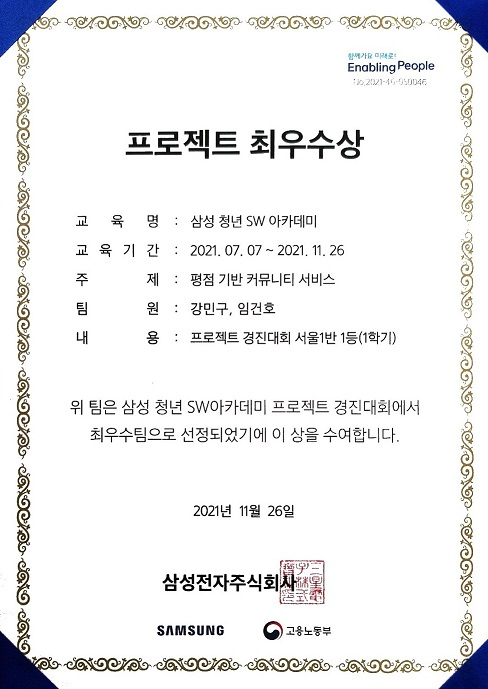
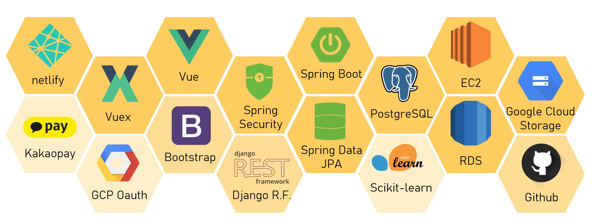
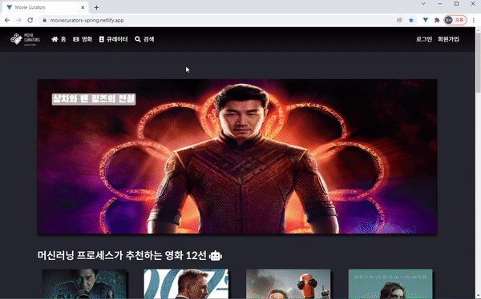
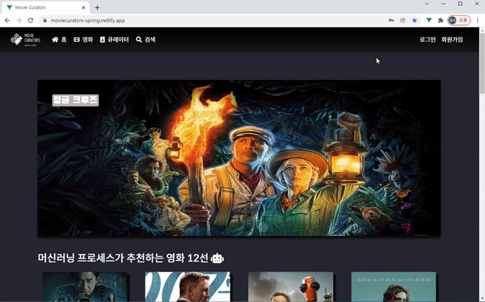
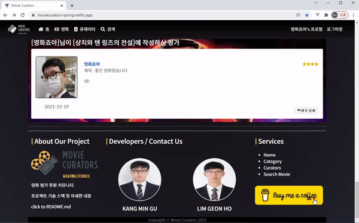
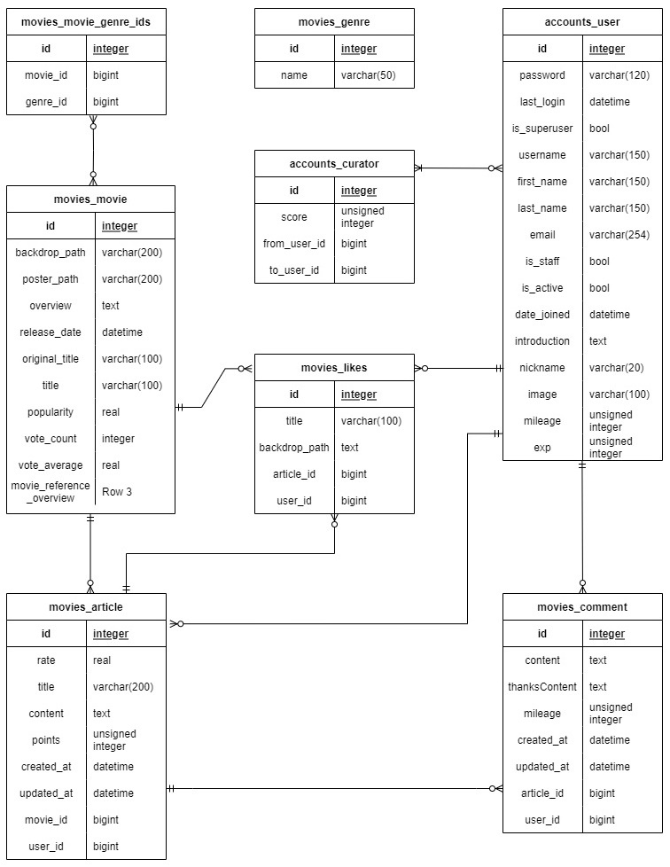
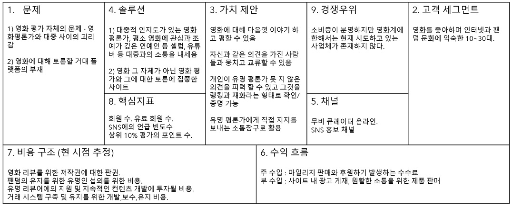

# MOVIE CURATORS

### - SSAFY 1학기 최우수 프로젝트



- 배포1 : https://moviecurators.com (Back : Spring Server + AWS EC2 + RDS + Google Cloud Storage)
- 배포2 : https://moviecurators.netlify.app/ (Back : Django Server + Heroku)

* 자세한 구현과 설명 기술적 정보 제공을 위해 별도의 산출물 외에도 PPT, DOCX가 제공되어있습니다.
* [PPT와 Docx로 이동](pjt-final-sub)

## 0. 개요

### - 개요

영화 정보 제공, 추천 커뮤니티 사이트 만들기

사이트에서 영화의 정보를 제공하고 토론 공간을 만들어주면 

유저들은 영화에 대한 별점과 함께 평가를 생성/수정/삭제할 수 있고,

다른 유저들은 그 평가를 보고, 댓글을 생성/수정/삭제 해가면서 의견을 공유하고

[좋아요]와 [후원하기]를 통하여 해당 유저 내지 평가를 지원할 수 있습니다.


### - 기술스택 / Requirements



- back1 : Spring (Java 11) framework, Web, Spring Data JPA, Spring Security, Validation, Lombok
- back2 : Django Restframework, imagekit
- front : Vue.js, vuex, vue-router, vuetify, Bootstrap, sweetalert2
- DB : postgreSQL
- 데이터 전처리, 분석 : Scikit-learn, pandas


## 1. 프로젝트 소개

### 1-1. Home


홈은 인구통계학적 필터링을 이용한 머신 러닝 프로세스로 선정한 영화 12편과 캐로셀을 시작으로

특정 기간(일주일, 분기)내에 HOT한(가장 높은 내부 평가를 받은) 평가들을 소개하고,

마지막으로 프로젝트와 저희를 간략히 소개하는 푸터로 이루어져 있습니다.


### 1-2. Oauth



손님에게는 기본적으로 영화 상세 기능을 제외하고는 영화/ 유저검색기능이 제공되지 않습니다.

구글 인증을 한다면, 회원가입을 하지 않고도 검색 기능을 제공받을 수 있습니다.


### 1-3 . 회원가입



회원가입시 검색 외에도 평가, 댓글 관련 권한과 프로필, 좋아요, 후원하기 등 사이트에서 제공하는 모든 서비스를 제공받으실 수 있습니다.

회원가입 문제 발생시 안내되는 에러 메시지는 modal을 사용하였고,

로컬 언어에 따라서 영어 메시지나 타 언어도 표기할 수 있게 확장성 있게 구축하였습니다. (Spring 서버 한정)

회원가입은 가입시에는 최소의 정보만 받지만, 찜 목록, 안내 메일 등의 추가 서비스를 신청할 경우 필요한 추가 정보를 받는 2차 가입 구조로 기획하였습니다.


### 1-4. 영화 인기/최신/평점/장르 별 조회 및 검색


각 조건에 맞는 영화를 출력하게 하거나, 검색할 수 있습니다.

검색 기능은 띄어쓰기, 소문자, 대문자를 포함한 한글/ 영어/ 숫자 검색이 가능합니다.


### 1-5. 프로필


프로필에서는 유저 상세 정보 확인 외에도, 프로필 변경과 마일리지 충전 기능을 이용하실 수 있습니다.

프로필 변경시 저장사진은 200*200으로 Processed 되어 Google Cloud Storage에 저장됩니다.


### 1-6. 영화 상세


모든 영화 포스터나 이미지를 통하여 영화 상세로 접근할 수 있고, 영화의 제목, 줄거리, 평점, 개봉일 등의 영화와 관련된 정보가 제공됩니다.

관련 영화 추천은 컨텐츠 기반 필터링 중 줄거리 기반 추천을 TF-IDF 벡터라이저를 이용한 유사성 점수 계산 머신러닝 프로세스로 구현

영화에 대한 평가를 작성하고, 다른 유저가 적은 평가를 사이트 내부 기준 평가에 따른 정렬 순으로 관람하실 수 있습니다.


### 1-7. 댓글달기. 좋아요, 후원하기 기능


다른 유저의 평가에 댓글을 달거나, [좋아요]와 [마일리지 후원]이 포함된 후원 댓글 달기를 할 수 있습니다.

후원 댓글은 일반 댓글보다 상위에 표시되며, 더 많은 마일리지를 사용한 댓글이 위에 배치됩니다.

위 예시에서처럼 [좋아요]와 [마일리지 후원]을 많이 받은 평가는 내부 산정 기준에 따라 홈과 영화 상세에서 상위에 위치하게 됩니다


### 1-8. 프로필 액자


[좋아요] 한 평가나 [후원하기]한 유저의 썸네일은 자동적으로 프로필에 보관하게 하여 후원하기 좋은 환경을 조성하였습니다.


### 1-9. 카카오 결제 기능



카카오 결제를 통해 프리미엄 회원으로 전환할 수 있습니다. (구현과 테스트는 가능하지만 실제 금액 이동은 없음)

프리미엄 회원은 [좋아요]에 더 좋은 평가를 받거나 향후 운영에 혜택을 받을 수 있습니다.


### 1-10. ERD



- UX를 고려하여 '3번 이동하여 갈 수 없는 곳, 볼 수 없는 정보가 있으면 안된다' 라는 기본 방침을 전제로 프론트와 ERD를 구성하였습니다.
- POST 횟수 보다 GET 요청이 많은 커뮤니티 특성상, POST시 연산을 최대화 하여 GET시 부담을 줄이자는 생각으로, 조인이 가장 많이 필요한 좋아하기 테이블을 분리하고 DB에 저장하였습니다.


### 1-11. Business Model



스타트업에서 쓰이는 린 캔버스를 이용하여 어떤 서비스 이용자가 이용할 것이고,

그 사용자에게 우리가 어떤 가치를 제공할 수 있고, 어떤 서비스를 구축해야하는지 파악하였습니다.


## 2. Getting Started

#### 전처리(00_Movie DB Maker)

pjt-final-sub 폴더의 00.Movie DB Maker 내의 00.movie_api.py와 01.ML_recommend.py를 실행.

최종 생성된 tmdb2.json을 back(pjt-final-drf)의 movies\fixtures폴더 내로 이동

```
python manage.py loaddata tmdb2.json
```

로 DB에 영화 데이터 적재. 동작 시점은 하위에 기술.


#### back1(pjt-final-spring)

```
gradle 설치 후 동작
```

#### back2(pjt-final-drf)

```
python -m venv -venv  # 가상 환경 설정
source venv/Scripts/Activate  # 가상 환경 가동
pip install -r requirements.txt  # 필요 패키지 설치

python manage.py makemigrations  # 필요하다면
python manage.py migrate  # migrate 후
python manage.py loaddata tmdb2.json  # 위의 영화 파일 적재
python manage.py runserver  # 서버 가동
```

#### front(pjt-final-vuex)

```
npm i // 패키지 설치
npm run serve // 서버 가동
```

각각 back1(pjt-final-spring)은 build.gradle

back2(pjt-final-drf)는 requirements.txt

front(pjt-final-vuex)는 package.json에 상세한 모듈이 기재되어 있습니다.

